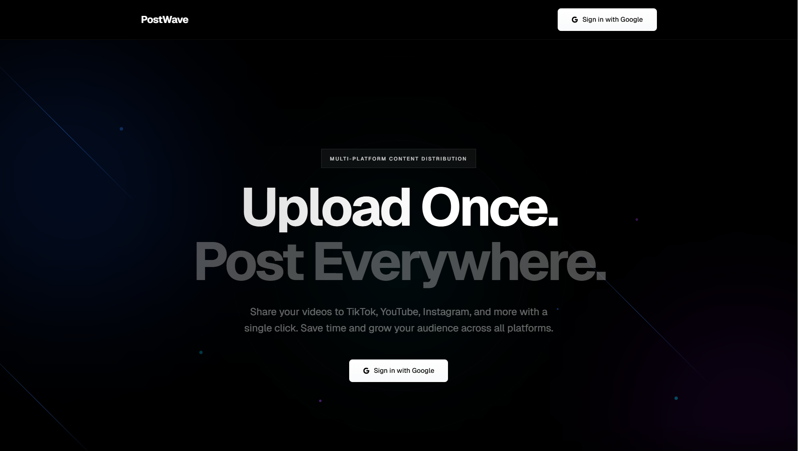

# PostWave

**Upload Once. Post Everywhere.**

PostWave is a modern multi-platform content distribution tool that allows creators to upload videos once and share them across TikTok, YouTube, Instagram, and more with a single click. Built with a minimal, dark aesthetic and smooth animations inspired by Linear and Stripe.

---

## Screenshots

---

## Features

- **Multi-Platform Support** - Connect and post to YouTube, TikTok, and Instagram simultaneously
- **OAuth Integration** - Secure authentication with Google and social platform OAuth flows
- **Video Management** - Upload, organize, and track your video content in one place
- **Post History** - Monitor posting attempts, status, and errors across all platforms
- **Profile Management** - Customize your profile with avatar uploads and personal information
- **Beautiful UI** - Minimalist dark theme with animated hero section and smooth transitions
- **Real-time Updates** - Track post status with live feedback and error handling

---

## Tech Stack

- **Framework**: [Next.js 15](https://nextjs.org/) with App Router
- **Language**: TypeScript
- **Styling**: [Tailwind CSS 4](https://tailwindcss.com/)
- **Database**: [Supabase](https://supabase.com/) (PostgreSQL)
- **Authentication**: Supabase Auth with OAuth

---

**YouTube, TikTok, Instagram:**
- Follow platform-specific OAuth setup documentation
- Store credentials in environment variables
- Configure redirect URIs properly

## Contributing

Contributions are welcome! Please feel free to submit a Pull Request.

## License

This project is licensed under the MIT License - see the [LICENSE](LICENSE) file for details.

**Made with ♥ by [A-Shalchian](https://github.com/A-Shalchian)**
